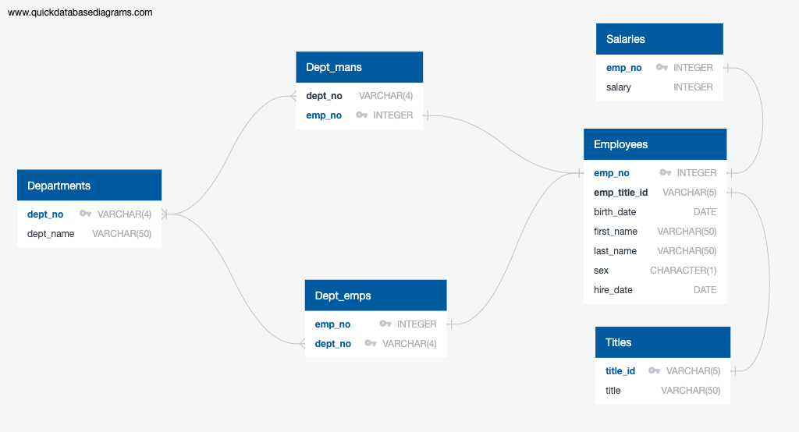
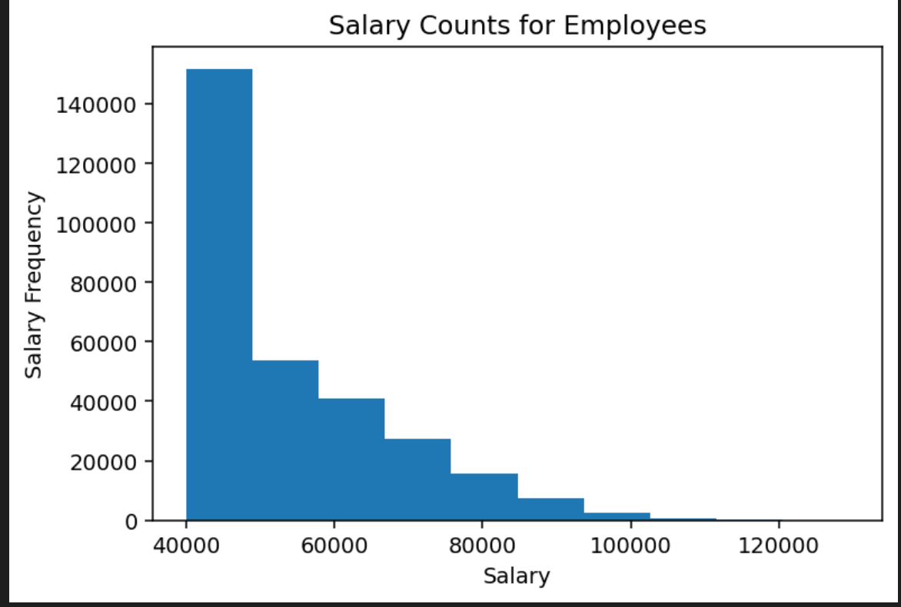
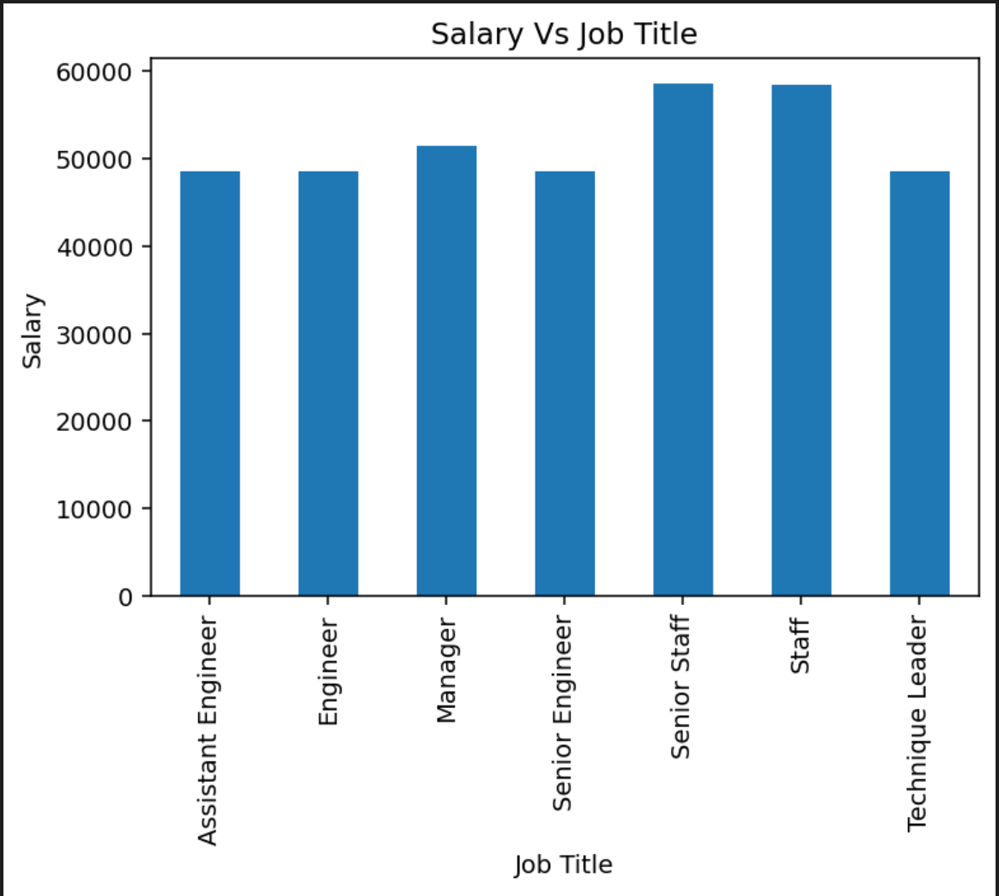

# Employee Database: A Mystery in Two Parts

## Background

It is a beautiful spring day, and it is two weeks since you have been hired as a new data engineer at Pewlett Hackard. Your first major task is a research project on employees of the corporation from the 1980s and 1990s. All that remain of the database of employees from that period are six CSV files.

In this assignment, you will design the tables to hold data in the CSVs, import the CSVs into a SQL database, and answer questions about the data. In other words, you will perform:

1. Data Engineering/ Data Modelling

2. Data Analysis

## Instructions

#### Data Modelling

Inspect the CSVs and sketch out an ERD of the tables. Feel free to use a tool like [http://www.quickdatabasediagrams.com](http://www.quickdatabasediagrams.com).

#### Data Engineering

* Use the information you have to create a table schema for each of the six CSV files. Remember to specify data types, primary keys, foreign keys, and other constraints.

  * For the primary keys check to see if the column is unique, otherwise create a [composite key](https://en.wikipedia.org/wiki/Compound_key). Which takes to primary keys in order to uniquely identify a row.
  * Be sure to create tables in the correct order to handle foreign keys.

* Import each CSV file into the corresponding SQL table. **Note** be sure to import the data in the same order that the tables were created and account for the headers when importing to avoid errors.

#### Data Analysis

Once you have a complete database, do the following:

1. List the following details of each employee: employee number, last name, first name, sex, and salary.

2. List first name, last name, and hire date for employees who were hired in 1986.

3. List the manager of each department with the following information: department number, department name, the manager's employee number, last name, first name.

4. List the department of each employee with the following information: employee number, last name, first name, and department name.

5. List first name, last name, and sex for employees whose first name is "Hercules" and last names begin with "B."

6. List all employees in the Sales department, including their employee number, last name, first name, and department name.

7. List all employees in the Sales and Development departments, including their employee number, last name, first name, and department name.

8. In descending order, list the frequency count of employee last names, i.e., how many employees share each last name.

## Bonus

As you examine the data, you are overcome with a creeping suspicion that the dataset is fake. You surmise that your boss handed you spurious data in order to test the data engineering skills of a new employee. To confirm your hunch, you decide to take the following steps to generate a visualisation of the data, with which you will confront your boss:

1. Import the SQL database into Pandas.

2. Create a histogram to visualise the most common salary ranges for employees.

3. Create a bar chart of average salary by title.

## Epilogue

Evidence in hand, you march into your boss's office and present the visualisation. With a sly grin, your boss thanks you for your work. On your way out of the office, you hear the words, "Search your ID number." You look down at your badge to see that your employee ID number is 499942.

### Copyright

© 2021 Trilogy Education Services, LLC, a 2U, Inc. brand. Confidential and Proprietary. All Rights Reserved.

## **Summary**:

## **Languages used**:
- SQL
- Python
  
## **Database used**:
- PostgreSQL

## **Python Packages Used**:
- Pandas
- SQLAlchemy
- Matplotlib
  

## **Screenshots**
## **Entity Relationship Diagram**

## **Salary Counts**

## **Salry VS Job**

## Employee Table

## **Running all the code**
## Creating the Database
1. In PgAdmin create a new database
2. Right click on the database you created and select *Query Tool*. Copy and paste the contents from *Schema.sql*. Press run.
3. Right click on the table you want to enter data for, and the click *Import/Export* and enter the corressponding csv file.
4. Open up another query tool and copy and paste the contents from *queries.sql*.
5. Press run.

## **Running the jupyter notebooks**
1. Before running any of the jupyter notebooks please install needed packages running the following code in the terminal.
         
        pip install pandas
        pip install sqlalchemy
        pip install matplotlib

Or run this code in the first Jupyter Notebook

        ! pip install --user pandas
        ! pip install --user sqlalchemy
        ! pip install --user matplotlib.pyplot

1. Enter your PGAdmin password and database name in *config.py* and then save.

2. Run the file *Bonus.ipynb* 
